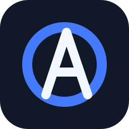

# Axiom

<p align="center">
  
</p>

[](https://github.com/theworker02/axiom)
[](LICENSE)
[](https://www.rust-lang.org/)
[](docs/RELEASES/1.3.1.md)
[](docs/ACQUISITION.md)
[](docs/PRIVACY.md)
[](docs/REALITY.md)
[](AGENTS.md)
[](https://thanks.dev/u/gh/theworker02)

**Axiom** is an independent, from-scratch **browser engine and browser** written in Rust. Temporary name until branding settles.

The **orbital A** is Axiom's official mark. It is embedded into the native Windows executable,
used by the desktop window at runtime, and appears on the trusted new-tab page.

Axiom fetches, parses, styles, lays out, paints, and displays pages in a native window — **without** embedding Chromium, Blink, WebKit, Gecko, Servo, Electron, CEF, or a system WebView for page rendering.

> **Privacy by construction:** Axiom has no AI integration, telemetry SDK, analytics pipeline,
> advertising identifier, tracking beacon, account requirement, or private-browsing upload path.
> Browser data stays in the selected local profile unless the user deliberately navigates to a
> website or chooses a search provider. See [the privacy statement](docs/PRIVACY.md).

> Compatibility with the modern web is a **target**, not an architectural dependency. Where Axiom can do something mainstream browsers cannot (extreme observability, resource control, engine inspection), that advantage is intentional.

---

## Table of contents

1. [Why Axiom exists](#why-axiom-exists)
2. [What ships today](#what-ships-today)
3. [What does not ship](#what-does-not-ship)
4. [Quick start](#quick-start)
5. [Acquisition & install](#acquisition--install)
6. [Keyboard shortcuts](#keyboard-shortcuts)
7. [Profiles & persistence](#profiles--persistence)
8. [Workspace layout](#workspace-layout)
9. [Architecture (high level)](#architecture-high-level)
10. [Development](#development)
11. [Testing policy](#testing-policy)
12. [Documentation map](#documentation-map)
13. [Roadmap phases](#roadmap-phases)
14. [Privacy](#privacy)
15. [Non-negotiables](#non-negotiables)
16. [Funding](#funding)
17. [License](#license)

---

## Why Axiom exists

Mainstream browsers are extraordinary products — and enormous shared codebases. Axiom exists to:

- Own the pipeline end-to-end (HTML → DOM → CSS → style → layout → paint → composite)
- Instrument every stage with real timings (not marketing FPS)
- Build a browser **application** (tabs, profiles, omnibox, sessions) on top of that engine
- Explore differentiators: resource governance, engine inspector, workspace/session control (later waves)

Axiom is **not** a Chrome skin.

---

## What ships today

Honest summary (see `docs/REALITY.md` and phase progress docs for detail):

| Capability | Status |
|------------|--------|
| HTTPS navigation + paint in a native window | Functional |
| Multi-tab independent browsing contexts | Functional (Wave A) |
| Omnibox (edit, classify URL vs search, suggestions) | Functional (Wave B) |
| Persistent profiles, history, bookmarks, settings, sessions | Functional (Wave C) |
| Private browsing isolation | Functional (Wave C) |
| JavaScript (Boa) → DOM → paint, fetch, XHR | Functional / evolving web-platform coverage |
| Flexbox / Grid / full CSS | Partial / ongoing compatibility work |
| Cookies / localStorage / fetch / CORS | Functional foundations; standards coverage continues |
| Multiprocess / GPU compositor | Deferred |

---

## What does not ship

- No Chromium/WebKit/Gecko embedding for rendering
- No claim of “Chrome compatibility”
- No claim of Firefox-level web compatibility; conformance is tracked through focused Web
  Platform Test results rather than an invented percentage
- No fabricated compatibility percentages
- No automatic execution of downloads
- No remote omnibox suggestion phones-home (local sources only)

---

## Privacy

- **No AI integration.** Axiom does not call an LLM, model-hosting service, or AI API.
- **No telemetry or analytics.** There is no metrics upload, crash-report upload, behavioral
  tracking, advertising ID, or product analytics endpoint.
- **No private-data tracking.** History, bookmarks, cookies, sessions, cache and Web Storage are
  profile-owned local data. Private profiles are memory-only and destroyed at close.
- **No account requirement.** Local browsing works without signing in.

This is not a promise about third-party websites: the site or search provider you choose can still
receive the network request needed to serve its content. Axiom does not add its own tracker to it.
Read the precise scope in [`docs/PRIVACY.md`](docs/PRIVACY.md).

For guided local setup, compatible coding agents can use the opt-in repository skill documented in [`docs/AGENT_SETUP.md`](docs/AGENT_SETUP.md). It is not an in-browser AI integration and cannot install or copy itself without user approval.

---

## Quick start

```bash
git clone https://github.com/theworker02/axiom.git
cd axiom

# Interactive browser (trusted new tab)
cargo run -p axiom-desktop

# Open a page
cargo run -p axiom-desktop -- https://example.com
cargo run -p axiom-desktop -- demos/click-works.html

# Private window
cargo run -p axiom-desktop -- --private

# Headless PPM
cargo run -p axiom-desktop -- --headless https://example.com
```

Requires Rust **1.80+** (`rustup`).

---

## Acquisition & install

Axiom is acquired from source. Full instructions:

- **[`docs/ACQUISITION.md`](docs/ACQUISITION.md)** — clone, build, run, verify
- **[`docs/CONTRIBUTING.md`](docs/CONTRIBUTING.md)** — contribution workflow
- **[`docs/CHANGELOG.md`](docs/CHANGELOG.md)** — release notes

For the 1.3.1 release train, Windows builds use a per-user NSIS installer and a portable ZIP.
The installer is deliberately unsigned until an Authenticode certificate is available, so verify
the published checksum before executing it. Automatic updates remain disabled.

---

## Keyboard shortcuts

| Shortcut | Action |
|----------|--------|
| Ctrl+L | Focus omnibox (select all) |
| Ctrl+T | New tab (`axiom://newtab`) |
| Ctrl+W | Close tab |
| Ctrl+Shift+T | Restore closed tab |
| Ctrl+Tab / Ctrl+Shift+Tab | Next / previous tab |
| Ctrl+R / F5 | Reload |
| Ctrl+D | Toggle bookmark |
| Alt+Left / Alt+Right | Back / Forward |
| F1 | Toggle performance HUD |
| Enter (omnibox) | Navigate / search / activate suggestion |
| Escape (omnibox) | Cancel edit; restore tab URL |

---

## Profiles & persistence

Wave C introduces the durable browser data platform:

- SQLite per persistent profile (`browser.sqlite`; schema migrations are versioned)
- History, bookmarks, settings, session checkpoints
- Private profiles: in-memory only; never restore after close
- Profile lock prevents two processes writing the same profile

Read:

- [`docs/PROFILES.md`](docs/PROFILES.md)
- [`docs/PERSISTENCE.md`](docs/PERSISTENCE.md)

Default desktop profile path for local runs:

```text
target/axiom-profile/
```

**Tests never touch your real user profile.** They use `tempfile` roots.

Internal pages:

| URL | Purpose |
|-----|---------|
| `axiom://newtab` | Trusted new tab |
| `axiom://history` | History (profile-backed) |
| `axiom://bookmarks` | Bookmarks |
| `axiom://version` | Build / profile diagnostics |
| `axiom://settings` | Trusted browser settings |
| `axiom://network` | Recent network diagnostics |
| `axiom://cookies` | Trusted cookie inspection |

---

## Workspace layout

```text
axiom/
├── crates/
│   ├── axiom-url/         URL parsing (http/https/axiom)
│   ├── axiom-net/         HTTP(S)
│   ├── axiom-html/        HTML parser
│   ├── axiom-dom/         DOM
│   ├── axiom-css/         CSS parser
│   ├── axiom-style/       Cascade
│   ├── axiom-layout/      Layout
│   ├── axiom-paint/       Display list + CPU raster
│   ├── axiom-gfx/         Window + chrome presentation
│   ├── axiom-js/          JS runtime (Boa)
│   ├── axiom-web/         Web API facade
│   ├── axiom-loader/      Resources + cache hooks
│   ├── axiom-events/      Events
│   ├── axiom-compositor/  Layers
│   ├── axiom-trace/       Timelines
│   ├── axiom-engine/      BrowsingContext + pipeline
│   └── axiom-browser/     Tabs, chrome, profiles, persistence
├── browser/desktop/       Host binary (`axiom`)
├── demos/                 Interactive demos
├── docs/                  Architecture + honesty docs
├── tests/                 Fixtures, vendored WPT / html5lib corpus, expectations
├── tools/compat/          Conformance suites + expectations ratchet (docs/COMPATIBILITY.md)
└── tools/test-runner/     Fixture runner
```

---

## Architecture (high level)

```text
URL / omnibox
    → Profile-owned policy (history, bookmarks, settings)
    → Navigation
    → HTML parse → DOM
    → CSS → style
    → layout → display list → raster
    → compositor offset
    → softbuffer window
         ▲
         └── Trusted chrome (tabs, toolbar, status) never drawn by web content
```

JavaScript (Boa) runs in-process for the current phase; multiprocess isolation is a later wave.

---

## Development

```bash
cargo fmt
cargo clippy --workspace -- -D warnings
cargo test --workspace
```

Useful package filters:

```bash
cargo test -p axiom-browser
cargo test -p axiom-engine --test click_js_pipeline
cargo run -p axiom-desktop -- demos/click-works.html
```

Logging:

```bash
# Windows PowerShell
$env:RUST_LOG="info,axiom_persist=debug"
cargo run -p axiom-desktop
```

Persistence diagnostics use log target `axiom_persist`.

---

## Testing policy

- Prefer end-to-end tests that cross subsystem boundaries for claimed features
- Persistence tests use temporary directories and clean up
- Private browsing isolation is tested explicitly (`wave_c.rs`)
- Do not convert failures into “unsupported” merely to inflate scores
- New compatibility work keeps the existing phase suites green and records focused WPT outcomes

---

## Documentation map

| Doc | Contents |
|-----|----------|
| `AGENTS.md` | Agent/engineering non-negotiables |
| `docs/REALITY.md` | Capability honesty |
| `docs/PHASE3_AUDIT.md` | Phase 2→3 audit |
| `docs/PHASE3_PROGRESS.md` | Current wave handoff |
| `docs/NETWORKING.md` | Profile-owned network and cache pipeline |
| `docs/COMPATIBILITY.md` | WPT/html5lib conformance evidence and known gaps |
| `docs/RELEASES/1.3.1.md` | 1.3.1 release notes, install and safety status |
| `docs/PRIVACY.md` | No-AI, no-telemetry and local-data privacy guarantees |
| `docs/PROFILES.md` | Profile architecture |
| `docs/PERSISTENCE.md` | Storage architecture |
| `docs/ACQUISITION.md` | How to get & build |
| `docs/CONTRIBUTING.md` | Contribution guide |
| `docs/CHANGELOG.md` | Changelog |

---

## Roadmap phases

1. **Phase 1** — First paint (complete)
2. **Phase 2** — Interactive engine (partial; JS scoped)
3. **Phase 3** — Browser platform and compatibility work  
   - Tabs, chrome, profiles, history, sessions, cookies and Web Storage ✅  
   - Networking, document/resource loading, Fetch/XHR/CORS foundations ✅  
   - HTML/DOM/CSS/layout compatibility: active WPT-driven work  
   - Multiprocess isolation, GPU compositing, accessibility and broad Web API coverage: future

---

## Non-negotiables

1. Do not implement “fake Chrome” by embedding another engine.
2. Do not claim features that are stubs.
3. Prefer measured performance over performance claims.
4. Correctness and security beat feature count.
5. Profile is the ownership boundary for durable data.

---

## Funding

If Axiom is useful to you:

- GitHub Sponsors: [@theworker02](https://github.com/sponsors/theworker02) (when enabled)
- thanks.dev: [https://thanks.dev/u/gh/theworker02](https://thanks.dev/u/gh/theworker02)

---

## License

MIT — see package / repository license metadata.

---

*Built with Rust. Rendered by Axiom — not by someone else’s browser.*
