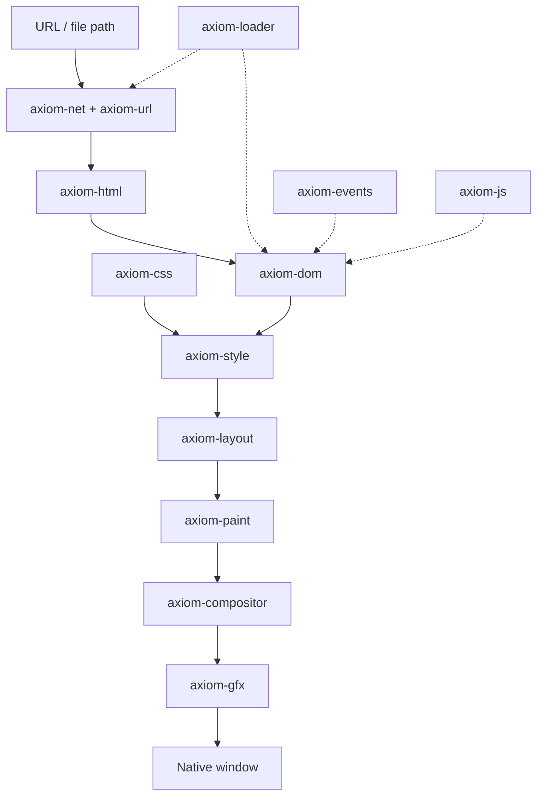

# Axiom architecture

Axiom is a **from-scratch browser engine** written in Rust. It does **not** embed Chromium, Blink, WebKit, Gecko, Servo-as-renderer, or any system WebView for HTML/CSS/layout/paint.

Third-party libraries are used only where explicitly allowed (TLS/HTTP transport, fonts, windowing, optional GPU APIs). **HTML parsing, DOM, CSS cascade, layout, paint, compositing, events, and JavaScript integration are Axiom-owned code** (JS via an embedder abstraction, not a full browser fork).

## High-level pipeline



### Document loading (Phase 3 Wave G)

```text
DOM / PARSER / SCRIPT  →  document loader (axiom-engine + axiom-document)  →  ResourceLoader  →  RequestScheduler  →  NetworkService
```

The parser, DOM and JS never issue requests. They report discovered elements and insertions;
the document loader registers a resource, checks policy and starts it through the tab's
`ResourceLoader`. Loader events come back on the UI thread and are routed by request to the
owning `DocumentId`; events for replaced documents are dropped. See
[DOCUMENT_LOADING.md](DOCUMENT_LOADING.md), [RESOURCE_LOADING.md](RESOURCE_LOADING.md),
[SCRIPT_LOADING.md](SCRIPT_LOADING.md), [PAGE_LIFECYCLE.md](PAGE_LIFECYCLE.md).

## Crate responsibilities

| Crate | Role | Phase 2 status |
|-------|------|----------------|
| `axiom-url` | Parse/join http(s) and file URLs | **SUPPORTED** (subset) |
| `axiom-net` | Per-profile `NetworkService` (rustls, H1/H2 via ALPN), `RequestScheduler`, RFC 9111 `HttpCache` (memory or disk), typed errors, activity stream, redacted network log. See [NETWORKING.md](NETWORKING.md), [HTTP_CACHE.md](HTTP_CACHE.md) | **SUPPORTED** |
| `axiom-loader` | `ResourceLoader`: browser request semantics (type, priority, initiator, limits, per-tab cancellation) above the scheduler | **SUPPORTED** |
| `axiom-csp` | Content Security Policy Level 3: policy parsing, source lists, nonces and hashes, directive fallback, request/inline/eval/`form-action`/`base-uri` checks, violation messages. Pure rules, no I/O; enforced by `axiom-engine`. See [CSP.md](CSP.md) | **FUNCTIONAL** |
| `axiom-document` | Document identity (`DocumentId`, `NavigationId`, `BrowsingContextId`), `DocumentLifecycle` (readyState, blocking sets, defer queue, timeline), per-document `ResourceRegistry` (`ResourceId`, eight states), script classification, priorities, preload scanner, `ContentPolicy` and mixed content, diagnostics. Pure data and rules, no I/O. See [DOCUMENT_LOADING.md](DOCUMENT_LOADING.md) | **SUPPORTED** |
| `axiom-download` | Per-profile `DownloadManager` on the profile scheduler; streaming, pause/resume, sanitized names. See [DOWNLOADS.md](DOWNLOADS.md) | **PARTIAL** (foundation; no download UI) |
| `axiom-html` | Tokenizer + tree builder; incremental `HtmlParser` (fed chunk by chunk, pauses at scripts) | **PARTIAL** |
| `axiom-dom` | Arena DOM + queries + mutations | **PARTIAL** → **SUPPORTED** for core APIs |
| `axiom-css` | Stylesheet parser | **PARTIAL** |
| `axiom-style` | Cascade + computed values | **PARTIAL** |
| `axiom-layout` | Box tree + block/inline layout | **PARTIAL** |
| `axiom-paint` | Display list + CPU raster | **SUPPORTED** (CPU) |
| `axiom-compositor` | Layers + scroll offsets | **PARTIAL** |
| `axiom-events` | EventTarget dispatch | **PARTIAL** |
| `axiom-js` | JS runtime abstraction | **PLANNED** (stub in tree) |
| `axiom-engine` | Pipeline orchestration; `BrowsingContext` navigations with `NavigationId` supersession, security state from verified TLS; the document loader (streaming commit, incremental parse, subresources, script scheduling, lifecycle events, generation guard) in `browsing/document.rs` and `browsing/resources.rs` | **SUPPORTED** (async `start_navigation`; the desktop browser still uses the blocking `navigate`, which waits for `DOMContentLoaded`) |
| `browser/desktop` | CLI + window host | **PARTIAL** (Phase 1 one-shot frame → Phase 2 loop) |

## Phase 1 vs Phase 2

**Phase 1** proved: URL → net → HTML → DOM → CSS → style → layout → display list → raster → window (single frame).

**Phase 2** adds interactivity without replacing the engine:

- Browsing context, history, fragment navigation
- Event loop (tasks, microtasks, timers)
- Input (click, keyboard, wheel), hit testing
- Mutable DOM + selector engine + dirty invalidation
- Async subresources and image decode
- Forms, scrolling, compositor layers
- Boa-backed JS behind `axiom-js` traits
- Demos under `demos/` and honest capability docs

## Future: incremental rendering

```text
DOM mutation → dependency graph → dirty style/layout/paint → partial re-run
```

Phase 2 introduces **dirty flags** on the DOM; full incremental layout is **PLANNED**.

See also: [PHASE2_PLAN.md](./PHASE2_PLAN.md), root [ARCHITECTURE.md](../ARCHITECTURE.md) (Phase 1 diagram).
