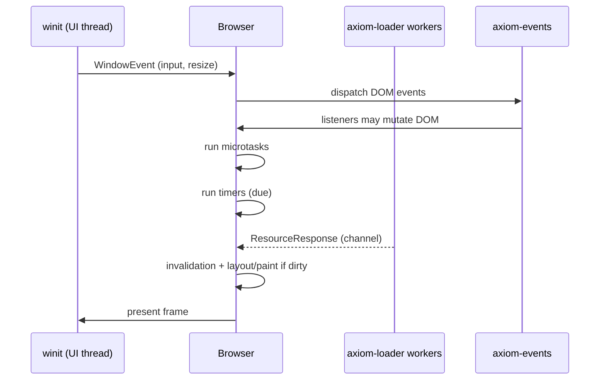

# Event loop

Phase 2 moves `browser/desktop` from a **one-shot render** to a **controlled event loop** on the UI thread (winit). Network and decode work stay on worker threads; completions post messages back.

## Model (target)

## Tasks

| Mechanism | Phase 2 |
|-----------|---------|
| UI events (winit) | **PARTIAL** (static window today) |
| DOM event dispatch (capture/bubble) | **PARTIAL** (`axiom-events` crate) |
| `click`, `keydown`, wheel | **PLANNED** (Wave A) |
| Timer queue (`setTimeout`) | **PLANNED** |
| Microtask queue (Promise jobs) | **PLANNED** |
| `requestAnimationFrame` | **PLANNED** |
| Idle callbacks | **UNSUPPORTED** |

## Threading rules

| Rule | Status |
|------|--------|
| No blocking HTTP on UI thread after Wave A | **PLANNED** |
| Loader worker pool | **SUPPORTED** (crate) |
| JS execution on UI thread | **PLANNED** (typical embedder model) |

## Invalidation coupling

DOM mutations set `DirtyFlags`; the browser coalesces **style → layout → paint** work per frame instead of running the full Phase 1 pipeline on every wheel tick when possible (**PARTIAL** / evolving).

See [DOM](./DOM.md), `axiom-events`, and `demos/events.html`.
