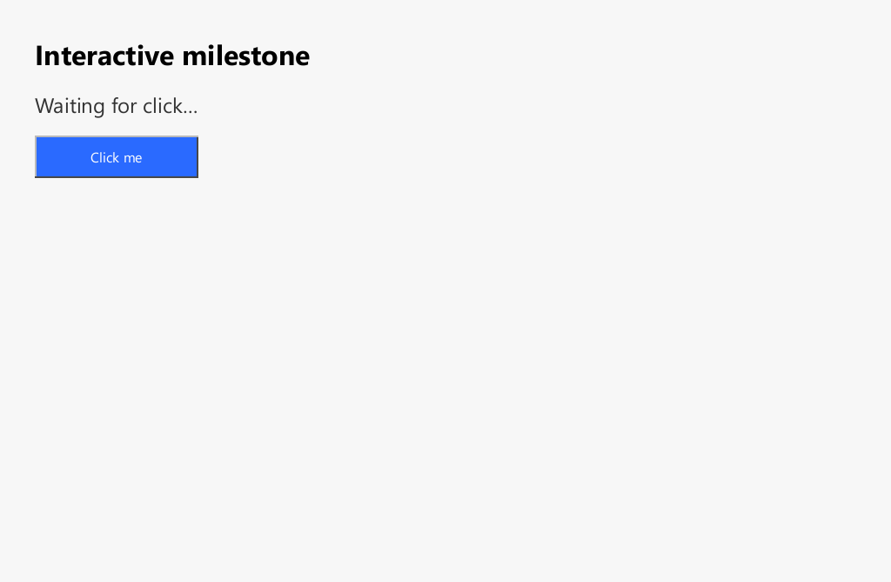

# Axiom 1.3.1 - Native polish and safer setup

Release date: 2026-10-03

## Highlights

- Refined the native Orbit Rail browser chrome with a restrained loading accent that honors the persisted reduced-motion preference.
- Windows installations now use `%LOCALAPPDATA%\Axiom\Profile` for the normal browser profile, avoiding write failures when the executable is installed under Program Files.
- A second normal-profile launch now shows a native explanation when the active Axiom process owns that profile, rather than failing silently. It directs the user to close the existing window or deliberately use `--private`.
- Added an opt-in repository skill for agent-assisted local setup. It is a developer workflow, not an Axiom product feature: the browser remains free of AI integration, telemetry, analytics and private-data tracking.
- Corrected release automation so that release notes and artifact names remain aligned with the published version.

## Installation

Use either `Axiom-Setup-1.3.1.exe` for the per-user Windows installer or `Axiom-1.3.1-windows-x86_64.zip` for the portable build.

The installer places the executable under the user-owned local application area. The normal profile is created only when Axiom first runs, under `%LOCALAPPDATA%\Axiom\Profile`. Private windows are memory-only and do not persist browser history, cookies, cache, sessions or site storage.

## Verification performed

- `cargo fmt --check`
- `cargo check -p axiom-desktop`
- `cargo clippy -p axiom-desktop -p axiom-gfx -- -D warnings`
- `cargo test -p axiom-browser settings_repo::tests`
- `cargo test -p axiom-desktop`
- `cargo build --release -p axiom-desktop`
- Headless native rendering of `demos/click-works.html`

## Render evidence

The following capture is produced by the 1.3.1 Axiom release executable while rendering the included interactive-demo page. It is an engine framebuffer capture, not a simulated browser mockup and not a screenshot of another browser.

## Privacy

Axiom does not integrate an AI service, telemetry/analytics pipeline, advertising SDK, tracking beacon, account requirement or automatic crash-report uploader. The optional agent setup skill cannot install itself or change an agent-global environment without explicit user approval. Read [`docs/PRIVACY.md`](../PRIVACY.md) for the precise scope.

## Known limitations

This release improves the native application shell and release behavior; it does not claim Chrome or Firefox web-platform parity. HTML/DOM/CSS/layout, JavaScript and security compatibility continue to be developed and measured through focused test suites.
