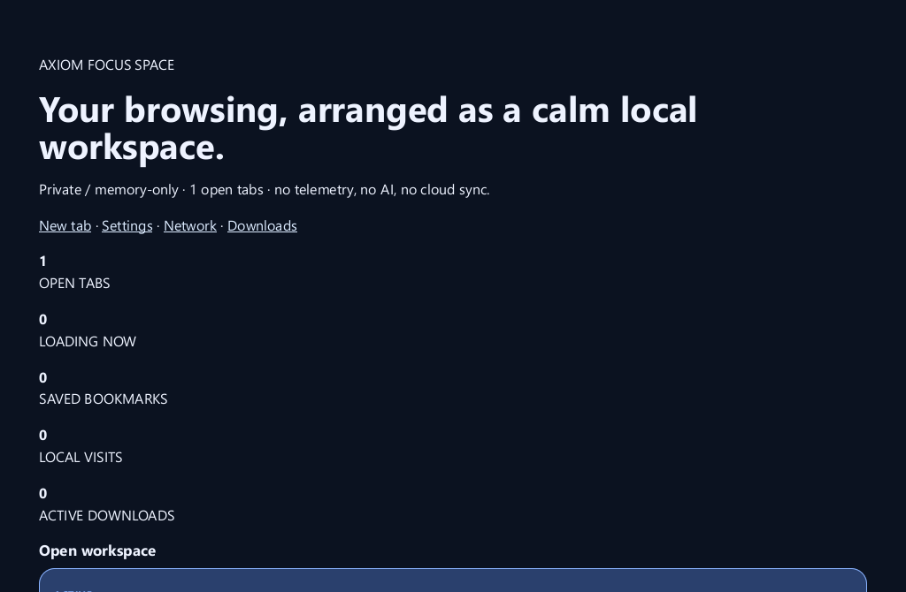

# Axiom 1.3.2 - Focus Space and native control polish

Release date: 2026-10-04

## Highlights

- Added **Focus Space** (`axiom://focus`): a local, profile-owned workspace overview
  for open tabs, loading activity, bookmarks, history and downloads.
- The native Orbit Rail now includes a visible violet Focus Space launcher. Use
  `Ctrl+Shift+Space` as the keyboard-first route.
- Focus Space uses a distinct Axiom visual language—deep navy, violet and teal surfaces,
  high-contrast active workspace cards and restrained state-aware motion—while retaining
  familiar browser information architecture.
- Trusted settings controls for performance HUD, session restore, clear-history-on-exit
  and clear-cookies-on-exit persist in the selected profile. The existing background
  navigation preference is now respected when a browser starts instead of being silently
  overwritten by the desktop host.
- Updated the WPT testharness expectation baseline after intentional XML/XHTML parser
  behavior improvements. This records observed outcomes; it does not claim broad browser
  compatibility.

## Installation

Use `Axiom-Setup-1.3.2.exe` for the per-user Windows installer or
`Axiom-1.3.2-windows-x86_64.zip` for the portable build.

The normal profile is created at `%LOCALAPPDATA%\Axiom\Profile` when Axiom first runs.
Private profiles are memory-only: their history, cookies, cache, sessions and site storage
are discarded when the private browser closes.

## Privacy

Axiom 1.3.2 has no AI integration, telemetry/analytics pipeline, advertising SDK, tracking
beacon, account requirement or automatic crash-report uploader. Focus Space calculates its
view locally from profile-owned state and does not upload browsing activity. The exact scope
is in [`docs/PRIVACY.md`](../PRIVACY.md).

## Verification

The release gate runs formatting, workspace Clippy, workspace tests, the Windows release
build and installer build in GitHub Actions. Locally, focused tests cover Focus Space routing,
trusted settings action persistence and settings repository behavior; the WPT testharness
ratchet is run against the refreshed expectation file.

## Render evidence

The following image was generated by the 1.3.2 release executable rendering
`axiom://focus` through Axiom's own HTML, DOM, CSS, layout, paint and compositor pipeline.
It is not a mockup or a screenshot from another browser.

## Known limitations

Axiom remains an independent browser engine, not a Chromium/Firefox compatibility clone.
HTML/DOM/CSS/layout, JavaScript, rendering, accessibility, security isolation and web API
coverage remain active WPT-driven work. The launcher and dashboard do not add cloud sync,
account-backed workspaces or an extension marketplace.
